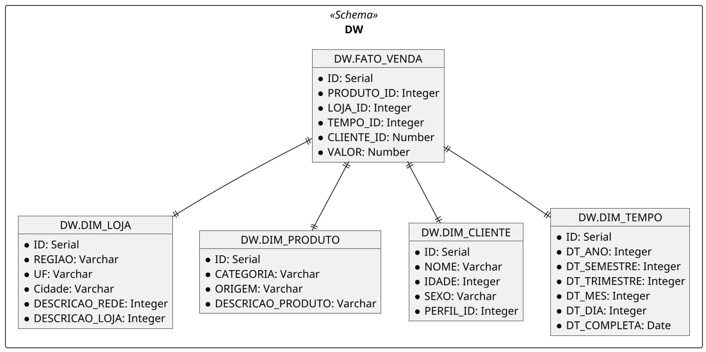

```plantuml
@startuml

scale 550 width
scale 550 height

rectangle "DW" <<Schema>> {

    object "DW.DIM_LOJA" as dwdimloja {
        * ID: Serial
        * REGIAO: Varchar
        * UF: Varchar
        * Cidade: Varchar
        * DESCRICAO_REDE: Integer
        * DESCRICAO_LOJA: Integer
    }

    object "DW.DIM_PRODUTO" as dwdimproduto {
        * ID: Serial
        * CATEGORIA: Varchar
        * ORIGEM: Varchar
        * DESCRICAO_PRODUTO: Varchar
    }

    object "DW.DIM_CLIENTE" as dwdimcliente {
        * ID: Serial
        * NOME: Varchar
        * IDADE: Integer
        * SEXO: Varchar
        * PERFIL_ID: Integer
    }
    
    object "DW.DIM_TEMPO" as dwdimtempo {
        * ID: Serial
        * DT_ANO: Integer
        * DT_SEMESTRE: Integer
        * DT_TRIMESTRE: Integer
        * DT_MES: Integer
        * DT_DIA: Integer
        * DT_COMPLETA: Date
    }

    object "DW.FATO_VENDA" as dwfatovenda {
        * ID: Serial
        * PRODUTO_ID: Integer
        * LOJA_ID: Integer
        * TEMPO_ID: Integer
        * CLIENTE_ID: Number
        * VALOR: Number
    }
}

dwfatovenda||--||dwdimloja
dwfatovenda||--||dwdimtempo
dwfatovenda||--||dwdimcliente
dwfatovenda||--||dwdimproduto

@enduml
```