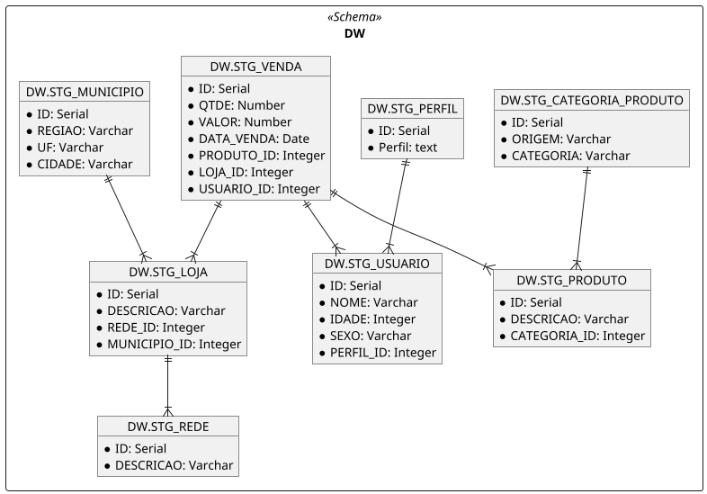

```plantuml
@startuml

scale 550 width
scale 550 height

rectangle "DW" <<Schema>> {

    object "DW.STG_REDE" as dwrede {
        * ID: Serial
        * DESCRICAO: Varchar
    }

    object "DW.STG_LOJA" as dwloja {
        * ID: Serial
        * DESCRICAO: Varchar
        * REDE_ID: Integer
        * MUNICIPIO_ID: Integer
    }

    object "DW.STG_PRODUTO" as dwproduto {
        * ID: Serial
        * DESCRICAO: Varchar
        * CATEGORIA_ID: Integer
    }
    object "DW.STG_CATEGORIA_PRODUTO" as dwcategoria {
        * ID: Serial
        * ORIGEM: Varchar
        * CATEGORIA: Varchar
    }

    object "DW.STG_USUARIO" as dwusuario {
        * ID: Serial
        * NOME: Varchar
        * IDADE: Integer
        * SEXO: Varchar
        * PERFIL_ID: Integer
    }
    
    object "DW.STG_PERFIL" as dwperfil {
        * ID: Serial
        * Perfil: text
    }

    object "DW.STG_VENDA" as dwvenda {
        * ID: Serial
        * QTDE: Number
        * VALOR: Number
        * DATA_VENDA: Date
        * PRODUTO_ID: Integer
        * LOJA_ID: Integer
        * USUARIO_ID: Integer
    }

    object "DW.STG_MUNICIPIO" as dwmunicipio {
        * ID: Serial
        * REGIAO: Varchar
        * UF: Varchar
        * CIDADE: Varchar
    }
}

dwperfil||--|{dwusuario

dwmunicipio||--|{dwloja
dwloja||--|{dwrede

dwcategoria||--|{dwproduto

dwvenda||--|{dwproduto
dwvenda||--|{dwloja
dwvenda||--|{dwusuario
@enduml
```