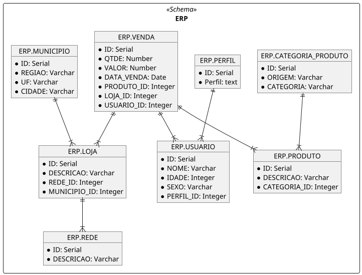

```plantuml
@startuml

scale 550 width
scale 550 height

rectangle "ERP" <<Schema>> {

    object "ERP.REDE" as erprede {
        * ID: Serial
        * DESCRICAO: Varchar
    }

    object "ERP.LOJA" as erploja {
        * ID: Serial
        * DESCRICAO: Varchar
        * REDE_ID: Integer
        * MUNICIPIO_ID: Integer
    }

    object "ERP.PRODUTO" as erpproduto {
        * ID: Serial
        * DESCRICAO: Varchar
        * CATEGORIA_ID: Integer
    }
    object "ERP.CATEGORIA_PRODUTO" as erpcategoria {
        * ID: Serial
        * ORIGEM: Varchar
        * CATEGORIA: Varchar
    }

    object "ERP.USUARIO" as erpusuario {
        * ID: Serial
        * NOME: Varchar
        * IDADE: Integer
        * SEXO: Varchar
        * PERFIL_ID: Integer
    }
    
    object "ERP.PERFIL" as erpperfil {
        * ID: Serial
        * Perfil: text
    }

    object "ERP.VENDA" as erpvenda {
        * ID: Serial
        * QTDE: Number
        * VALOR: Number
        * DATA_VENDA: Date
        * PRODUTO_ID: Integer
        * LOJA_ID: Integer
        * USUARIO_ID: Integer
    }

    object "ERP.MUNICIPIO" as erpmunicipio {
        * ID: Serial
        * REGIAO: Varchar
        * UF: Varchar
        * CIDADE: Varchar
    }
}

erpperfil||--|{erpusuario

erpmunicipio||--|{erploja
erploja||--|{erprede

erpcategoria||--|{erpproduto

erpvenda||--|{erpproduto
erpvenda||--|{erploja
erpvenda||--|{erpusuario
@enduml
```